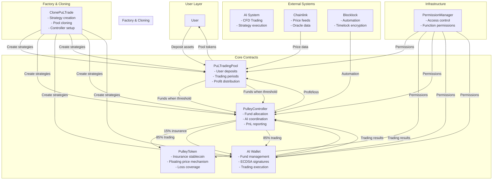
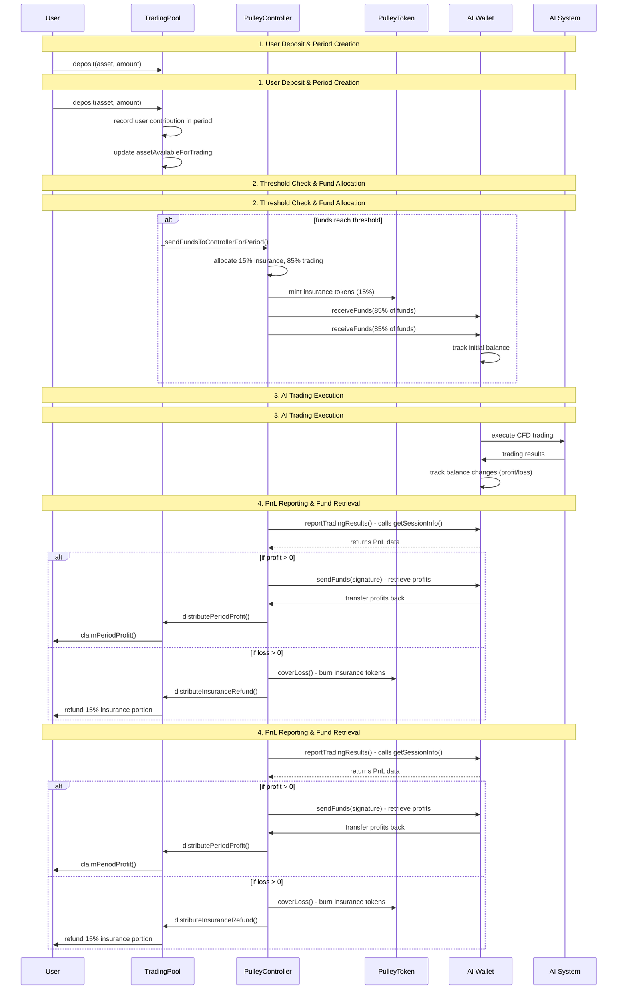
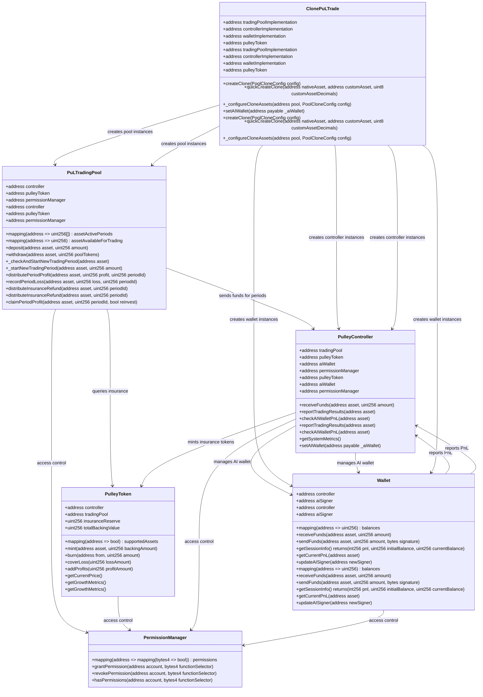
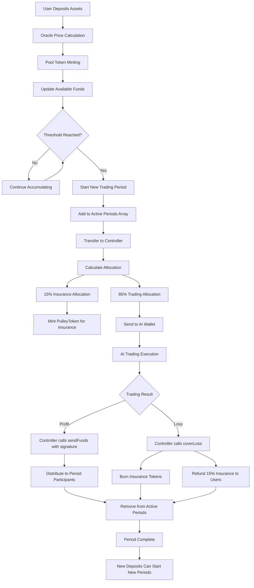
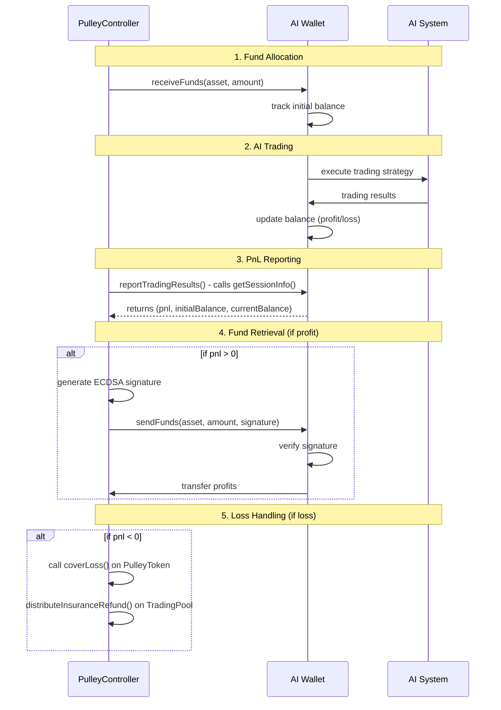
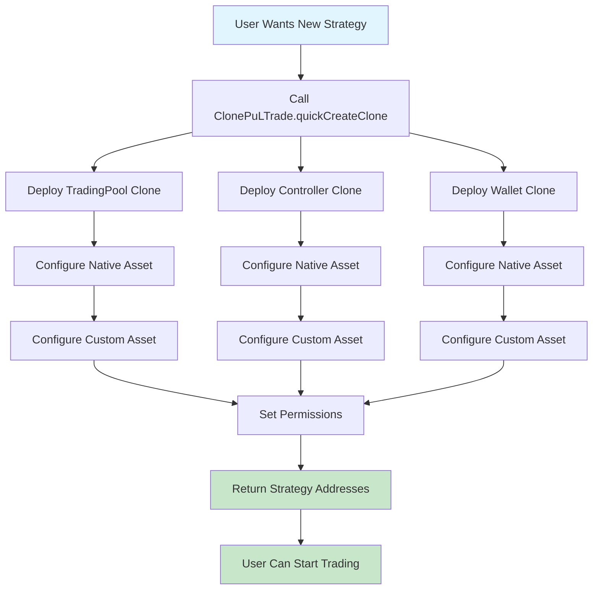

# Pulley Protocol - AI Trading with Insurance

Pulley Protocol is a DeFi trading system that enables users to participate in AI-driven trading strategies while providing insurance coverage through a floating stablecoin mechanism. The system features Chainlink price feeds, automated profit/loss distribution, and dual minting logic for insurance coverage.

## System Architecture Overview
## System Architecture Overview



## Complete Trading Flow
## Complete Trading Flow



## Contract Architecture & Relationships
## Contract Architecture & Relationships



## Fund Flow Diagram



## AI Wallet PnL Flow



## Clone Factory Strategy Creation




## Mathematical Foundation

### PulleyToken Price Calculation

The PulleyToken uses a floating price mechanism based on the insurance reserve and total backing value:

```
P(t) = (Total Backing Value + Insurance Reserve) / Total Supply
```

Where:
- `P(t)` = Current price of PulleyToken at time t
- `Total Backing Value` = Sum of all asset values backing the token
- `Insurance Reserve` = Accumulated insurance funds
- `Total Supply` = Current circulating supply of PulleyTokens

### Growth Rate Calculation

The growth rate determines how the token price increases over time:

```
Growth Rate = (Insurance Reserve / Total Backing Value) × 100%
```

### Fund Allocation Formula

When funds reach the threshold, they are allocated as follows:

```
Insurance Allocation = Total Funds × 0.15
Trading Allocation = Total Funds × 0.85
```

### Profit Distribution

When trading results in profit:

```
User Profit Share = (User Contribution / Total Period Contribution) × Net Profit × 0.90
Insurance Growth = Net Profit × 0.10
```

Where:
- `Net Profit` = Trading Profit - Gas Costs - Fees
- `0.90` = 90% goes to users
- `0.10` = 10% goes to insurance reserve

### Loss Coverage Calculation

When trading results in loss:

```
Insurance Required = |Loss Amount|
Tokens to Burn = Insurance Required / Current PulleyToken Price
User Refund = User's 15% Insurance Portion
```

### PnL Calculation

The AI Wallet calculates PnL as:

```
PnL = Current Balance - Initial Balance
PnL% = (PnL / Initial Balance) × 100%
```

### Period Profit Distribution

For each trading period, user profits are calculated as:

```
User Period Profit = (User Pool Tokens / Total Pool Tokens) × Period Net Profit
```

### Insurance Reserve Growth

The insurance reserve grows through:

```
New Reserve = Previous Reserve + (Trading Profit × 0.10) + New Insurance Allocations
```

### Token Minting Formula

When minting PulleyTokens for insurance:

```
Tokens to Mint = Insurance Allocation / Current PulleyToken Price
```

### Utilization Rate

The utilization rate affects the token price:

```
Utilization Rate = (Total Backing Value / (Total Backing Value + Insurance Reserve)) × 100%
```

### Price Impact of Losses

When losses occur and insurance is used:

```
New Price = (Total Backing Value - Loss Amount) / (Total Supply - Burned Tokens)
```

### Example Calculation

Let's say:
- User deposits $1000 USDC
- Threshold is $5000 (already reached)
- Current PulleyToken price = $1.05
- Trading results in $200 profit

**Allocation:**
- Insurance: $1000 × 0.15 = $150
- Trading: $1000 × 0.85 = $850

**PulleyToken Minting:**
- Tokens minted: $150 / $1.05 = 142.86 tokens

**Profit Distribution:**
- User profit: $200 × 0.90 = $180
- Insurance growth: $200 × 0.10 = $20

**New PulleyToken Price:**
- New reserve: Previous + $20
- New total backing: Previous + $1000 + $20
- New price: (New total backing) / (Previous supply + 142.86)

### Loss Scenario Example

If trading results in $300 loss:

**Insurance Coverage:**
- Tokens to burn: $300 / $1.05 = 285.71 tokens
- User refund: $150 (their 15% insurance portion)

**New PulleyToken Price:**
- New reserve: Previous - $300
- New total backing: Previous + $1000 - $300
- New price: (New total backing) / (Previous supply + 142.86 - 285.71)

### Advanced Mathematical Models

#### Compound Growth Model

For long-term price appreciation:

```
P(t) = P(0) × (1 + r)^t
```

Where:
- `P(0)` = Initial price
- `r` = Growth rate per period
- `t` = Number of periods

#### Risk-Adjusted Returns

The system calculates risk-adjusted returns as:

```
Sharpe Ratio = (Expected Return - Risk-Free Rate) / Standard Deviation
```

#### Insurance Coverage Ratio

The coverage ratio determines system stability:

```
Coverage Ratio = Insurance Reserve / (Average Loss × Loss Frequency)
```

#### Liquidity Pool Health

Pool health is measured by:

```
Health Score = (Available Liquidity / Total Deposits) × (1 - Utilization Rate)
```

## Contract Overview

| Contract | Purpose | Key Functions |
|----------|---------|---------------|
| `PuLTradingPool` | User deposits and trading periods | `deposit()`, `claimPeriodProfit()`, `distributePeriodProfit()` |
| `PulleyToken` | Insurance stablecoin | `mint()`, `burn()`, `coverLoss()`, `getCurrentPrice()` |
| `PulleyController` | Fund allocation and AI coordination | `receiveFunds()`, `reportTradingResults()`, `checkAIWalletPnL()` |
| `Wallet` | AI fund management | `receiveFunds()`, `sendFunds()`, `getSessionInfo()` |
| `ClonePuLTrade` | Strategy creation factory | `quickCreateClone()`, `createClone()` |
| `PermissionManager` | Access control | `grantPermission()`, `hasPermissions()` |

## Address
  === CORE CONTRACTS ===
  PermissionManager: 0xDba4B629FA01436E0f6849B54B4744ef65a53FDa
  Wallet: 0xCc323BC5DE01A1F3ab8F79CDdF49Fe9017375e74
  PulleyToken: 0xDfC78De351B42788F9a3704E60f1DEF108cCcDe2
  Clone Factory: 0x9f3C93dD934998B9B334bAd67fAC405733FcD98b
  
  === MAIN TRADING POOL (CREATED VIA CLONE) ===
  TradingPool: 0x44E7Efb96eB7D1677A6144285c81b8378661BbF8
  Controller: 0x0f3467e867760c8b188C46c5A283a88c90599E25
  
  === MOCK TOKENS ===
  USDC: 0xf63915eEB4d7d8f17f597CD3E2d749C8A43CF9F4
  USDT: 0x187af3FFbdF71172B217B8Ada11f39224FbCf935
  sToken: 0x63a2fB46b32CDF7DB176dd59d91Ef89D23E859d1