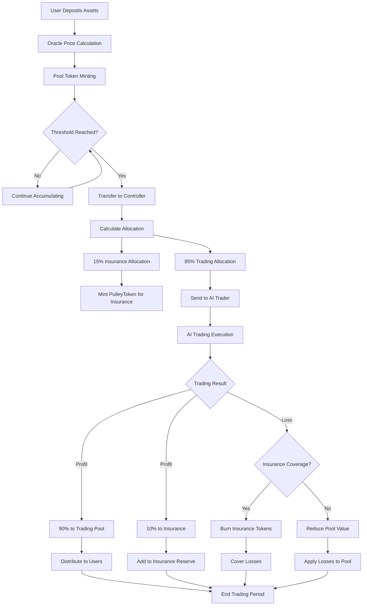
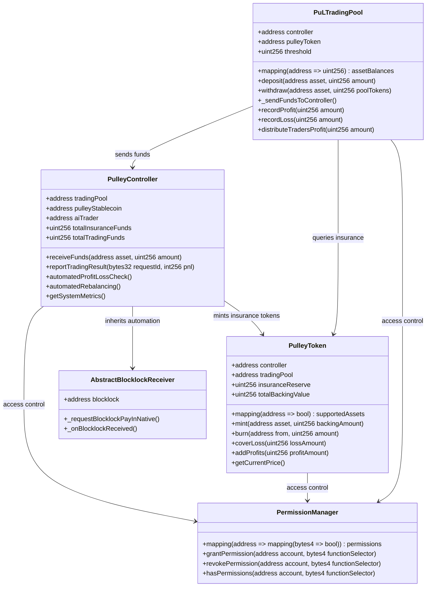
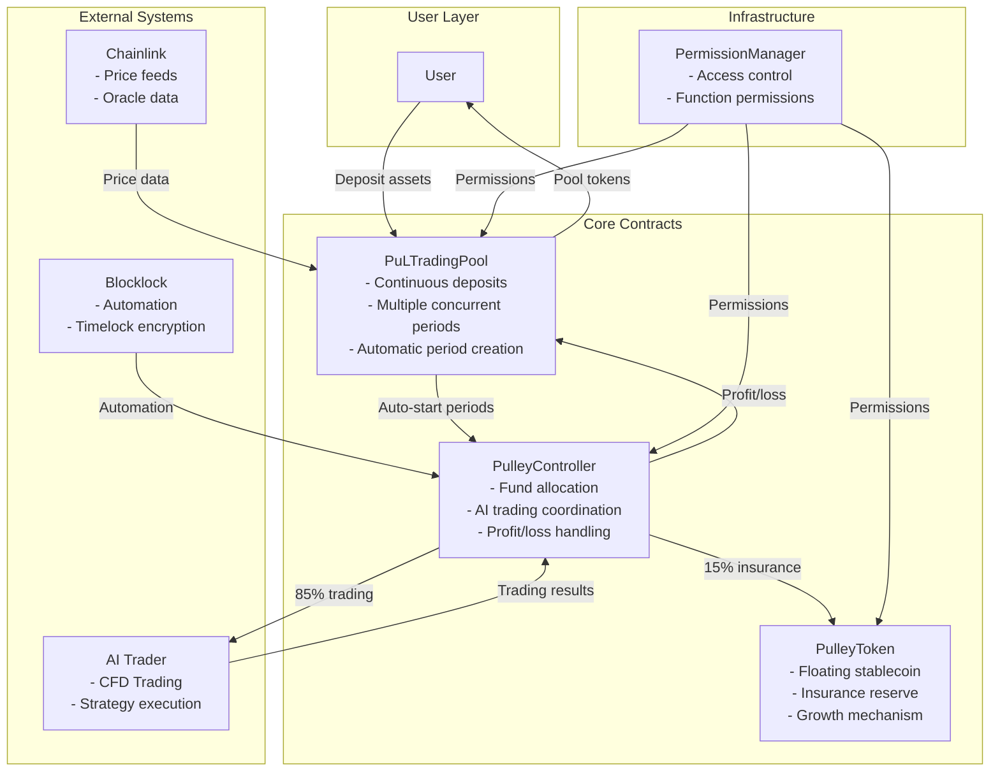
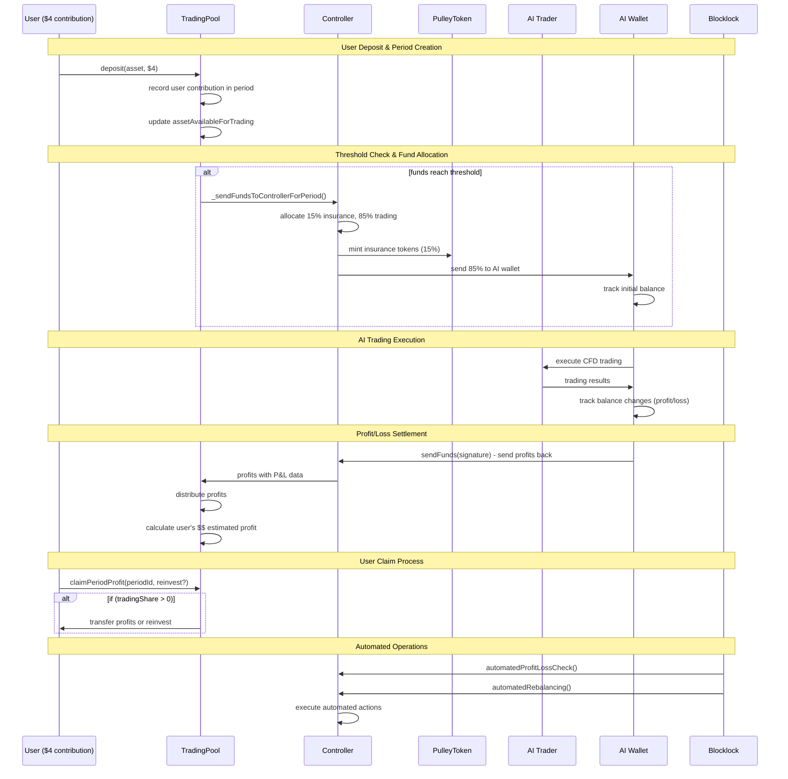
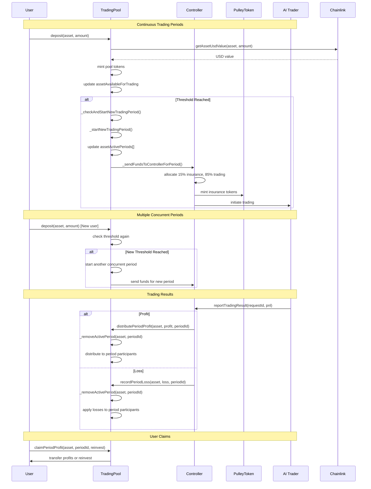
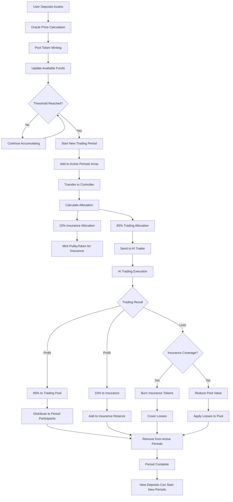
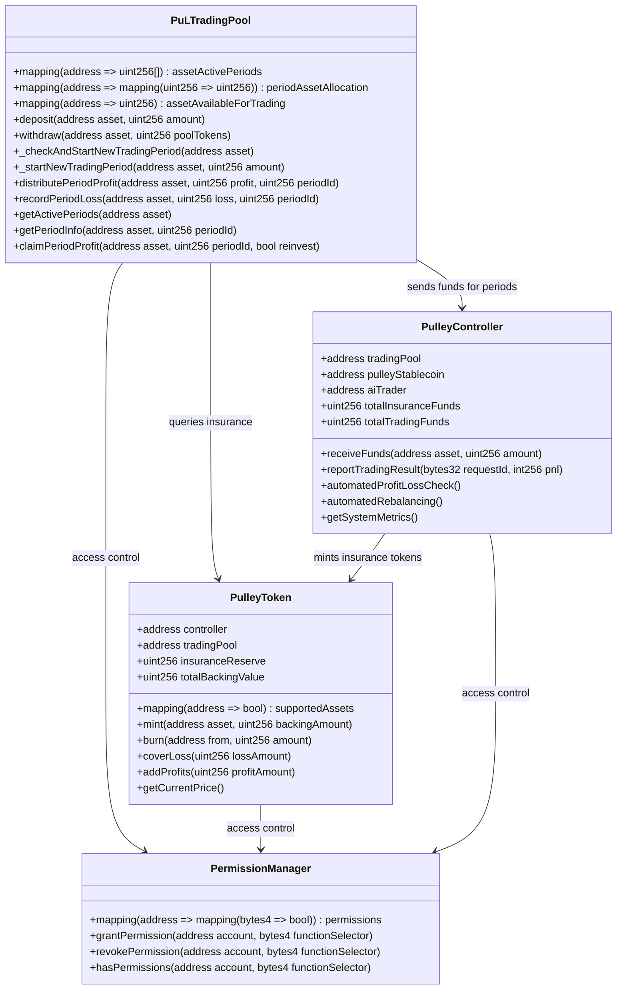

# Pulley Protocol - AI Trading with Insurance

Pulley Protocol is a DeFi trading system that enables users to participate in AI-driven trading strategies while providing insurance coverage through a floating stablecoin mechanism. The system features Chainlink price feeds, automated profit/loss distribution, and dual minting logic for insurance coverage.

## Fund Allocation Flow

## Contract Structure & Relationships

## How It Works

## Complete Protocol Workflow

## Continuous Trading Period Workflow

## Contract Structure & Relationships

