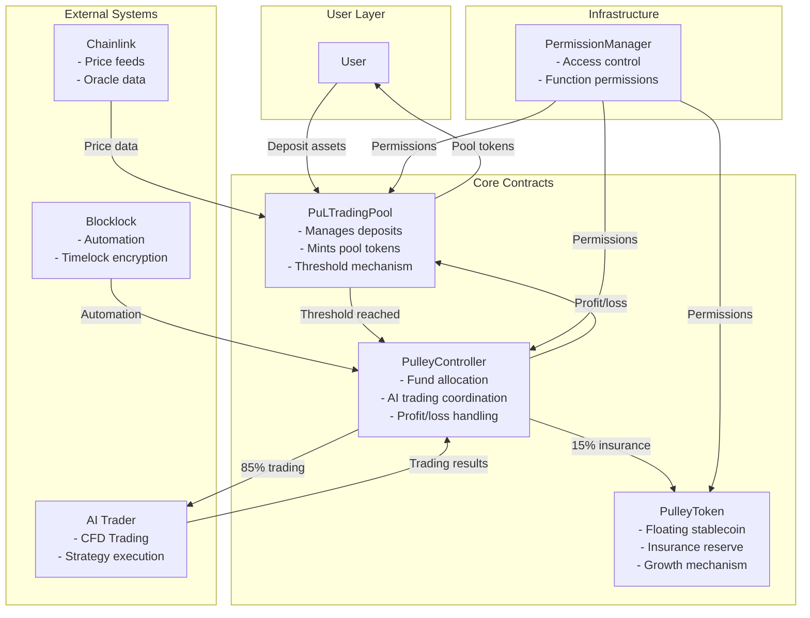
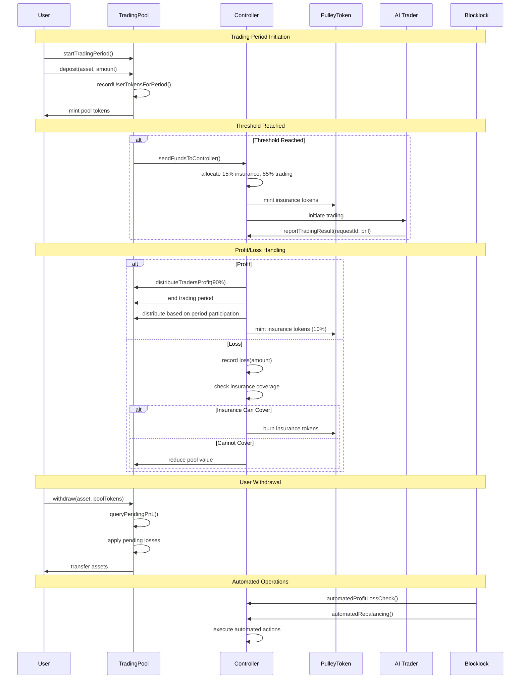
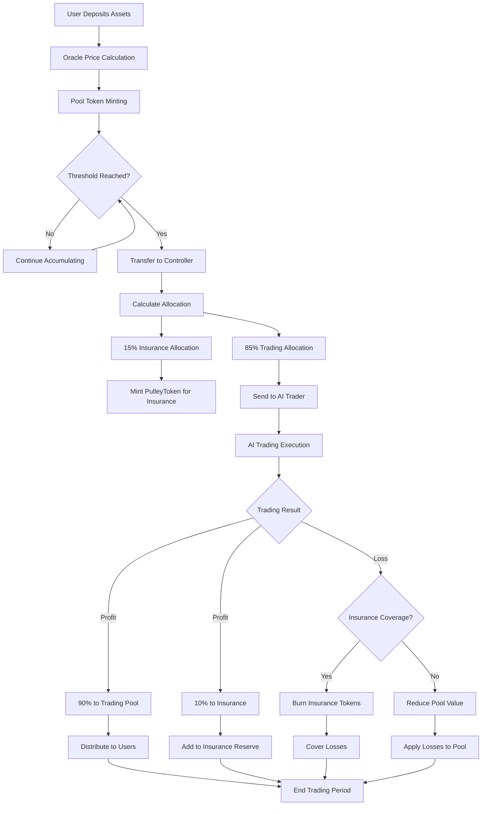
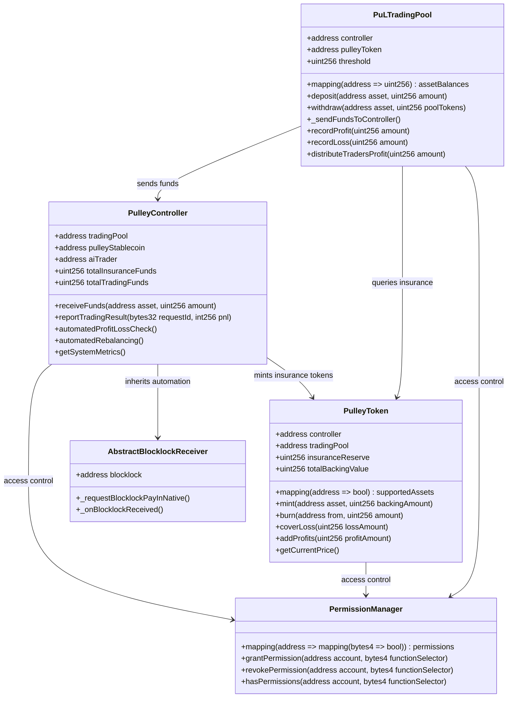

# Pulley Protocol - AI Trading with Insurance

Pulley Protocol is a DeFi trading system that enables users to participate in AI-driven trading strategies while providing insurance coverage through a floating stablecoin mechanism. The system features Chainlink price feeds, automated profit/loss distribution, and dual minting logic for insurance coverage.

## System Architecture Overview

## User Flow Sequence

## Fund Allocation Flow

## Contract Structure & Relationships

## Key Features & Benefits

### 🚀 **Simplified Architecture**
- Single-chain operation (no complex cross-chain)
- Four core contracts working in harmony
- Clear separation of concerns

### 💰 **Floating Stablecoin**
- PulleyToken grows with utilization
- Not pegged 1:1 like traditional stablecoins
- Dynamic pricing based on system performance

### 🛡️ **Insurance Mechanism**
- 15% of funds allocated to insurance
- Automatic loss coverage before pool impact
- Insurance reserve grows with profits

### 🤖 **AI Trading Integration**
- 85% of funds deployed to AI strategies
- Automated profit/loss reporting
- Real-time performance monitoring

### ⚡ **Automation**
- Blocklock-powered automation
- Automated profit/loss checking
- Automated rebalancing

### 🔒 **Security**
- Permission-based access control
- Reentrancy protection
- Oracle-based price feeds

## How It Works

### Simplified System Architecture
Pulley Protocol now operates as a simplified single-chain system with four core contracts:

1. **TradingPool** - Users deposit funds, get minted pool tokens based on oracle pricing, threshold mechanism triggers fund transfer
2. **PulleyToken** - Floating stablecoin that grows with utilization (NOT 1:1 ratio), anyone can mint
3. **PulleyTokenEngine** - Manages the floating stablecoin mechanics and growth
4. **Controller** - Receives funds when threshold reached, allocates 15% insurance / 85% AI trading

### Key Features
- **Oracle-based Pricing**: Each asset has stored decimals for proper USD conversion
- **Floating Stablecoin**: PulleyToken grows with utilization, not pegged 1:1
- **Threshold Mechanism**: Automatic fund transfer when deposits reach threshold
- **AI Trading Integration**: 85% of funds go to external AI trading system
- **Insurance Coverage**: 15% goes to insurance, covers losses first
- **Profit Distribution**: 10% to insurance, 90% back to trading pool
- **Blocklock Automation**: Automated profit/loss checking and rebalancing

### Asset Conversion & Bridging
When users deposit assets (ETH, USDC, Core Token, etc.) into Pulley on Kaia Network, the protocol follows this process:

1. **Asset Swapping**: All deposited assets are first converted to **Kaia native USDT** using the AssetSwapper contract
2. **Why USDT?**: USDT serves as the standard stable asset for cross-chain operations, providing:
   - Price stability during bridging
   - Universal acceptance across chains
   - Reduced slippage in destination chain operations
   - Consistent value representation

3. **Cross-Chain Bridging**: The USDT is then bridged from Kaia Network to Ethereum using LayerZero infrastructure

### Fund Allocation Strategy
Once bridged to Ethereum, the Controller allocates funds according to this strategy:

- **10% → Insurance Reserve**: Converted to Pulley Tokens for loss protection
- **45% → Nest Protocol Vaults**: Real-world asset (RWA) exposure on Ethereum
- **45% → Limit Order Trading**: Active trading strategies on Ethereum DEXs

### Insurance Mechanism
The Pulley Token acts as an insurance reserve for the entire system. When trading strategies generate profits:
- **50% of profits** are distributed to insurance providers (PulleyToken holders)
- **50% of profits** are reinvested in the trading pool

If trading strategies incur losses, the Pulley Token reserve automatically covers them, ensuring users' deposits remain protected.

## Technical Workflow

### 1. User Deposit (Kaia Network)
- User deposits assets into Pulley's trading vault on Kaia Network
- System checks if total assets exceed minimum threshold for efficiency

### 2. Asset Conversion & Bridging
- **AssetSwapper** converts all assets to Kaia native USDT
- **CrossChainController** initiates bridging to Ethereum via LayerZero
- USDT is transferred to Ethereum destination chain

### 3. Strategy Execution (Ethereum)
- **Nest Protocol Vaults**: 45% deployed to RWA yield-generating strategies
- **Limit Order Trading**: 45% deployed to active trading strategies
- **Insurance Reserve**: 10% held as Pulley Tokens for protection

### 4. Profit Collection & Distribution
- Profits from Ethereum strategies are bridged back to Kaia Network
- **50% → Insurance providers** (PulleyToken holders)
- **50% → Trading pool** for reinvestment

### 5. Continuous Cycle
- System continuously monitors and rebalances allocations
- Insurance reserve grows stronger over time
- Users benefit from Ethereum opportunities while staying on Kaia Network

## Why This Architecture?

### Kaia Network Benefits
- **Lower fees** for user deposits and withdrawals
- **Faster transactions** for day-to-day operations
- **Native asset support** for Core ecosystem tokens

### Ethereum Benefits
- **Largest DeFi ecosystem** with highest liquidity
- **Best yield opportunities** in RWA and trading strategies
- **Mature infrastructure** for complex financial operations

### Cross-Chain Bridge Benefits
- **Asset diversification** across multiple networks
- **Risk mitigation** through geographic and technical distribution
- **Access to best opportunities** regardless of chain location

## Key Components

- **AssetSwapper**: Converts assets to Kaia native USDT
- **CrossChainController**: Manages fund allocation and cross-chain messaging
- **LayerZero**: Provides secure cross-chain communication
- **Nest Protocol**: RWA vaults on Ethereum for yield generation
- **Trading Strategies**: Active limit order and spot trading on Ethereum DEXs

This architecture ensures users can access the best DeFi opportunities on Ethereum while maintaining the benefits of Kaia Network, all protected by a robust insurance system that grows stronger over time.