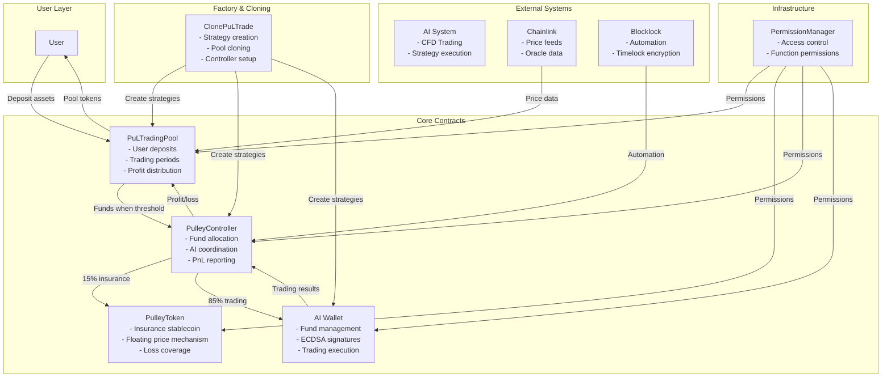
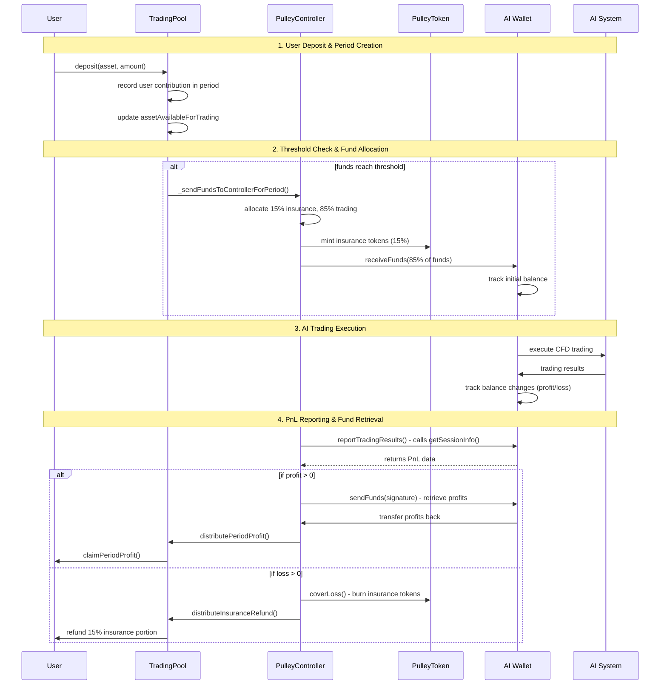
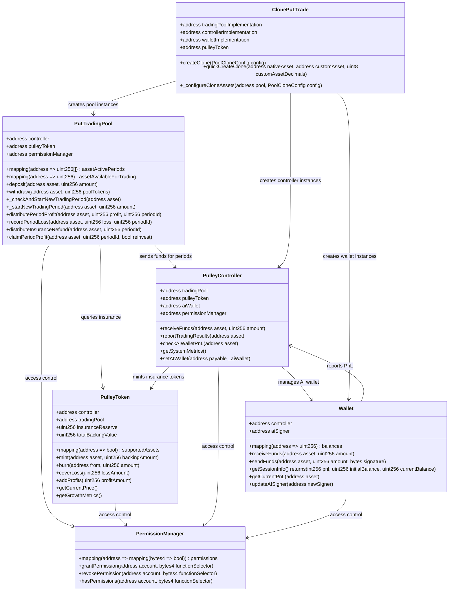

# Pulley Protocol - AI Trading with Insurance

Pulley Protocol is a DeFi trading system that enables users to participate in AI-driven trading strategies while providing insurance coverage through a floating stablecoin mechanism. The system features Chainlink price feeds, automated profit/loss distribution, and dual minting logic for insurance coverage.

## System Architecture Overview

## Complete Trading Flow

## Contract Architecture & Relationships

## Fund Flow Diagram

## AI Wallet PnL Flow

## Clone Factory Strategy Creation

## Contract Overview

| Contract | Purpose | Key Functions |
|----------|---------|---------------|
| `PuLTradingPool` | User deposits and trading periods | `deposit()`, `claimPeriodProfit()`, `distributePeriodProfit()` |
| `PulleyToken` | Insurance stablecoin | `mint()`, `burn()`, `coverLoss()`, `getCurrentPrice()` |
| `PulleyController` | Fund allocation and AI coordination | `receiveFunds()`, `reportTradingResults()`, `checkAIWalletPnL()` |
| `Wallet` | AI fund management | `receiveFunds()`, `sendFunds()`, `getSessionInfo()` |
| `ClonePuLTrade` | Strategy creation factory | `quickCreateClone()`, `createClone()` |
| `PermissionManager` | Access control | `grantPermission()`, `hasPermissions()` |

